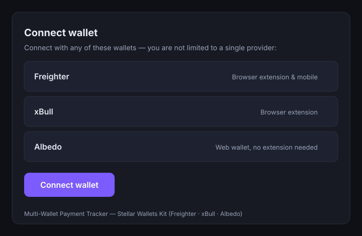

# Multi-Wallet Payment Tracker

A full-stack **Stellar / Soroban** dApp where users connect **any** supported
wallet and send payments to multiple recipient addresses. Each payment moves
through a visible lifecycle — *Pending → Submitting → Confirmed (with an
explorer link) → Failed (with a decoded, human-readable error)* — and a live
activity feed streams past payments straight from on-chain contract events.

Built as a Level 2 hackathon submission: smart contract + frontend + wallet
integration + a real testnet deployment with a verifiable transaction.

---

## Overview

- **Smart contract** (Rust + Soroban SDK v27) maintains a credit ledger and
  records payments, emitting a structured `PaymentRecorded` event per payment.
- **Frontend** (React + TypeScript + Vite) talks to Soroban RPC via
  `@stellar/stellar-sdk` and polls `getEvents` / `getTransaction` for live
  status.
- **Wallet layer** (Stellar Wallets Kit v2) supports **Freighter, xBull and
  Albedo** — multi-wallet, not a single hardcoded provider.

---

## Architecture

```
┌─────────────────────────┐        ┌──────────────────────────┐
│  React + Vite UI         │        │  Stellar Wallets Kit v2   │
│  WalletConnect           │ ─────▶ │  Freighter · xBull        │
│  PaymentForm             │  sign  │  Albedo (authModal)       │
│  TxStatus · ActivityFeed │        └──────────────────────────┘
└───────────┬─────────────┘
            │ @stellar/stellar-sdk  (simulate / send / getTransaction / getEvents)
            ▼
┌─────────────────────────┐        ┌──────────────────────────┐
│  Soroban RPC (testnet)  │ ─────▶ │  PaymentTracker contract  │
│  soroban-testnet.stellar│        │  deposit / record_payment │
│  .org                   │        │  get_payment / list_     │
└─────────────────────────┘        │  payments + PaymentRecorded│
                                   └──────────────────────────┘
```

**Flow:** the form builds an `invokeContractFunction` op → the SDK simulates it
(surfacing contract errors before signing) → the connected wallet signs the
assembled transaction (source-account authorization) → the SDK submits it →
`getTransaction` polls for confirmation while `getEvents` powers the feed.

---

## Project structure

```
/contract                      Soroban contract (Rust)
  Cargo.toml
  src/lib.rs                   types, storage, errors, events, functions
  src/test.rs                  unit tests (happy path + 3 error cases)
  deploy.sh                    testnet build + deploy script
/frontend                      React app
  src/lib/constants.ts         network + deployed contract ID
  src/lib/wallet.ts            Stellar Wallets Kit setup (multi-wallet)
  src/lib/contract.ts          contract call wrappers + event/status polling
  src/lib/errors.ts            contract error code → message mapping
  src/components/              WalletConnect · PaymentForm · TxStatus ·
                               ActivityFeed · Toast
/docs/wallet-options.svg       wallet-connect screen render
```

---

## Deployed contract (testnet)

| Item | Value |
| --- | --- |
| **Contract ID** | `CBK6NMEYPKVYHIIIRGFBMVE2BF55IYABU7FDDMEMTBOO3ONSBFIYEH7B` |
| WASM hash | `047043595e935bb1c3030d5874c78bd848a0acd9ad977e76ee42ad1701d4a718` |
| Explorer | https://stellar.expert/explorer/testnet/contract/CBK6NMEYPKVYHIIIRGFBMVE2BF55IYABU7FDDMEMTBOO3ONSBFIYEH7B |
| Lab | https://lab.stellar.org/r/testnet/contract/CBK6NMEYPKVYHIIIRGFBMVE2BF55IYABU7FDDMEMTBOO3ONSBFIYEH7B |

Deploy transaction: `b00d257db84e49e5e7b749aeb18c2c91080de73d52c383dc050eff56fa5eedbe`
([explorer](https://stellar.expert/explorer/testnet/tx/b00d257db84e49e5e7b749aeb18c2c91080de73d52c383dc050eff56fa5eedbe))

## Real on-chain transaction

A live `record_payment` call (100 XLM, memo `"first on-chain payment"`):

- **Tx hash:** `c90ea14cd79a579b9fc79af979ec133aa295546dc6171ddb93287b011547b1c1`
- **Explorer:** https://stellar.expert/explorer/testnet/tx/c90ea14cd79a579b9fc79af979ec133aa295546dc6171ddb93287b011547b1c1
- From: `GB5O34P7OW2QALPRJI4PE4W4KT36QX7EG7QIQQWKOL4WBR47N2G5NKCX`
- To: `GBTXXFCEOZRZKVGRUKKLQUCPV6UOPDGD23N5EA7PVOSOOM77DYPTJ7CP`
- Emitted event: `PaymentRecorded (payment_recorded)`, id `0`, amount `1000000000`
  stroops, timestamp `1787050138`.

---

## Custom errors

The contract exposes a `#[contracterror]` enum with **three** distinct,
triggerable errors, each mapped to its own user-facing message in the UI:

| # | Error | Triggered by | UI message |
| --- | --- | --- | --- |
| 1 | `InsufficientBalance` | `record_payment` where `amount > recorded balance` | "Insufficient balance — top up your recorded balance before sending." |
| 2 | `InvalidRecipient` | self-payment (`to == from`) or the zero address | "Invalid recipient — you can't pay yourself or the zero address." |
| 3 | `AmountTooSmall` | `amount <= 0` | "Amount is too small — it must be greater than zero." |

All three are covered by unit tests (`contract/src/test.rs`) and are
triggerable on-chain (a self-payment returns `HostError: Error(Contract, #2)`).

---

## Setup

### Prerequisites

- **Contract:** Rust 1.91+ with the `wasm32v1-none` target, and the
  [Stellar CLI](https://developers.stellar.org/docs/tools/cli/install-cli)
  (v27). Install:

  ```bash
  curl --proto '=https' --tlsv1.2 -sSf https://sh.rustup.rs | sh -s -- -y
  . "$HOME/.cargo/env"
  rustup target add wasm32v1-none
  curl -fsSL https://github.com/stellar/stellar-cli/raw/main/install.sh | sh
  ```

- **Frontend:** Node 18+ and npm.

### Contract — build & test

```bash
cd contract
stellar contract build       # emits target/wasm32v1-none/release/payment_tracker.wasm
cargo test                   # runs 7 unit tests
```

### Contract — deploy to testnet

```bash
cd contract
./deploy.sh                  # builds, generates + friendbot-funds a deployer, deploys
```

The script prints the contract ID and saves it to
`contract/deployed_contract_id.txt`. It generates a deployer identity
(`payment-tracker-deployer`) and funds it via friendbot on first run.

### Frontend — install & run

```bash
cd frontend
npm install
npm run dev        # http://localhost:5173
```

`frontend/src/lib/constants.ts` already points at the deployed contract above.

---

## Wallet options

Connecting opens the Stellar Wallets Kit modal with multiple wallet options.
The connect card renders:

- **Freighter** — Browser extension & mobile
- **xBull** — Browser extension
- **Albedo** — Web wallet, no extension needed



> To capture a live screenshot, run `npm run dev`, click **Connect wallet**,
> and save the modal to `docs/wallet-options.png`.

---

## Live demo

Run locally with `npm run dev` (testnet). Deployment to Vercel/Netlify is
out of scope for this submission but the build is static (`npm run build` →
`frontend/dist`).

---

## Toolchain versions

| Component | Version |
| --- | --- |
| Rust / cargo | 1.97.1 |
| Stellar CLI | 27.1.0 |
| soroban-sdk | 27.0.x (`wasm32v1-none` target) |
| @stellar/stellar-sdk | 16.x |
| @creit.tech/stellar-wallets-kit | 2.5.x |
| React / Vite / TypeScript | 18 / 5 / 5 |
